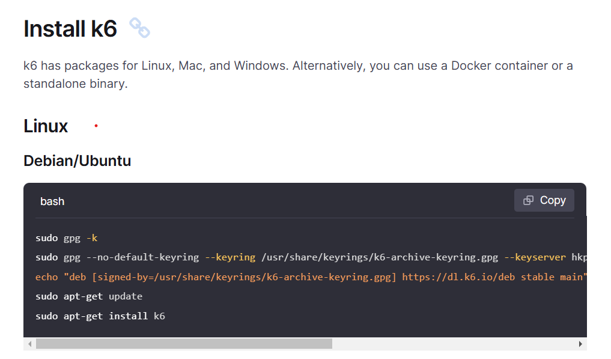
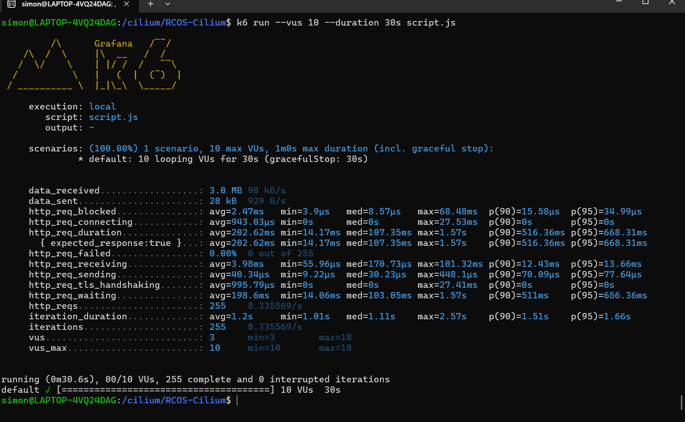

K6 allows developers to record front end user activity as if a user is doing legit requests and then generate the k6s code from the extension, this will allow you to fine tune application load testing.

Installing K6

Run the following commands

$ k6 new
$ k6 run script.js

successful run:

