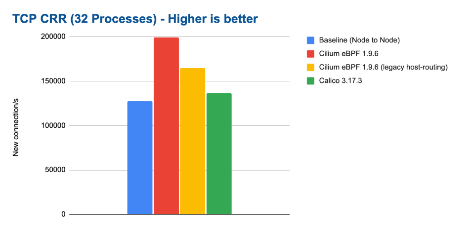
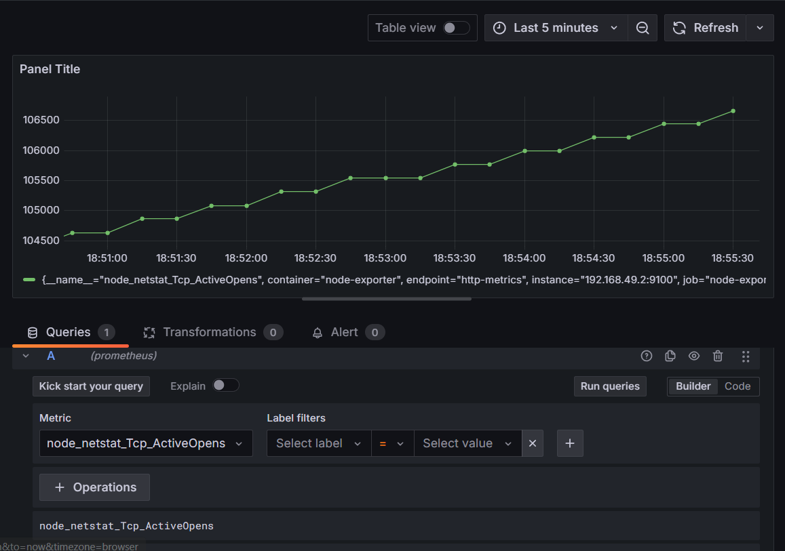

Based on the Cillium network testing of the connection rate, I aimed to do additional testing with just a minikube cluster. 

)

Key observations:

The metric being tracked is "node_netstat_Tcp_ActiveOpens" which represents the number of active TCP connections that have been initiated
There's a steady upward trend, indicating continuous new TCP connection attempts

Traffic generation and connection generator:
$ sudo apt install apache2-utils
$ ab -n 1000 -c 100 http://192.168.49.2:32415/

Starting value is around 106,000 connections

Ending value is approximately 108,000 connections

This shows roughly 2,000 new TCP connections were established during the time window in the graph shown.