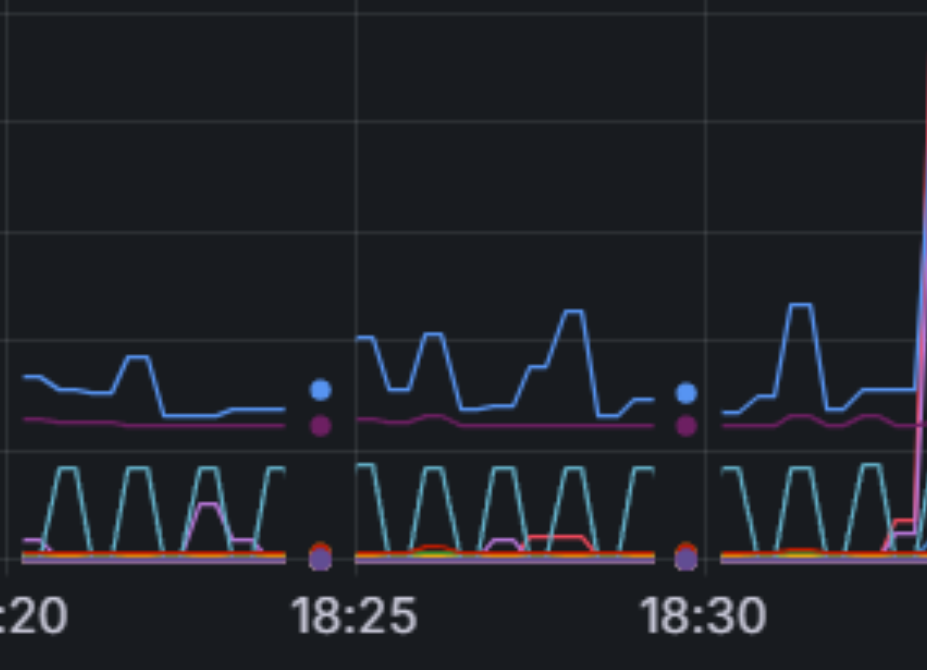
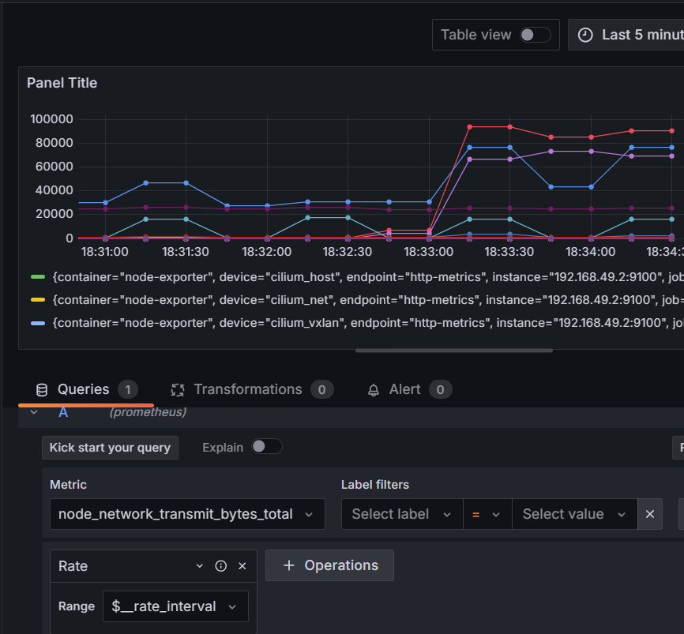

Start an iperf server on the TCP Echo service:
iperf -s -p 32415
Run a client test:
iperf -c 192.168.49.2 -p 32415 -t 60

prometheus query to run:
rate(node_network_transmit_bytes_total[1m])

Run the following command to send traffic:
while true; do echo "test" | nc 192.168.49.2 32415; done

