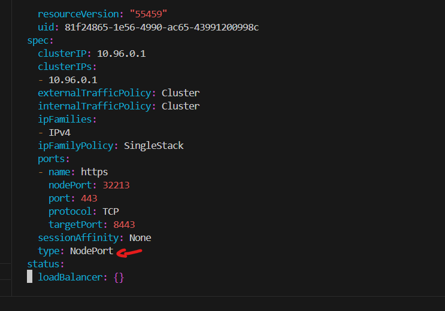
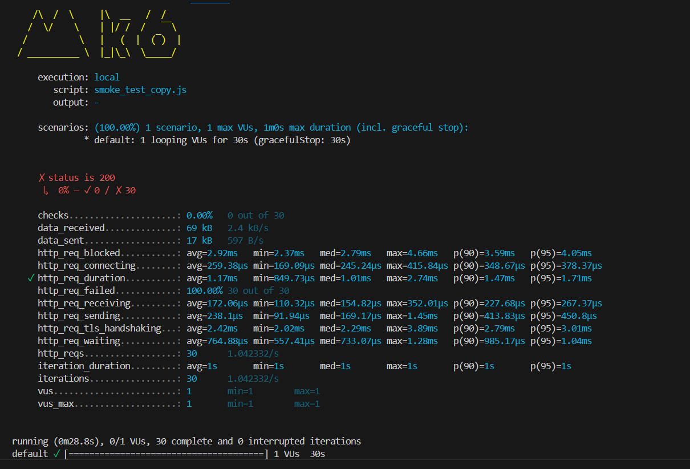

Smoke test Usage:

Verify that the system works well under minimal load and to gather baseline performance values.

Key Points:
- Everytime a script is created or updated, a smoke test is necessary.
- Keep thruput small and short
- verify no errors
- performance metrics

change the service type from ClusterIP to NodePort so that minikube can be accessed

to get ip do: 
minikube ip

sample starting smoke test:

The test will:
Run a single virtual user
Make requests to the health endpoint for 30 seconds
Check if responses are successful (200)
Ensure response times are under 500ms
Wait 1 second between requests