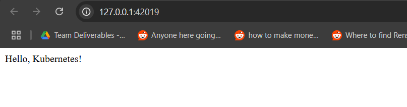
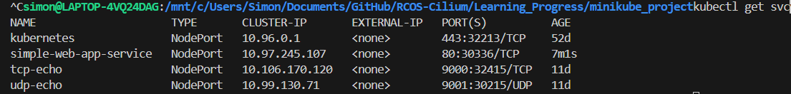

This is documenting the simple web application that I was able to deploy using minikube

Some technologies that I had to learn and use is a deployment.yaml, a docker image file, and a service.yaml

building the docker file
docker build -t simple-web-app:1.1 .
MUST REBUILD EVERYTIME THAT THE APP.PY is updated

Commands ran 

$ minikube start
starts the kubernetes cluster.

$ minikube ip
Gets the ip of the kubernetes cluster 

$ kubectl get svc  
Gets all infomation within the kubernetes cluster and displays it. Keep track of the cluster IP and the port

TO RUN 
$ minikube service simple-web-app-service --url
Starts the process of the web app service, this returns the url and copy and paste the url into a web browser to see the contents
example: 

docker image errors:
# Login to Docker Hub
docker login

# Replace YOUR_DOCKERHUB_USERNAME with your actual username
docker tag simple-web-app:latest YOUR_DOCKERHUB_USERNAME/simple-web-app:latest
docker push YOUR_DOCKERHUB_USERNAME/simple-web-app:latest

Then modify the deployment.yaml to use the correct image name:

Edit deployment.yaml to change the image line to:
image: YOUR_DOCKERHUB_USERNAME/simple-web-app:latest

Reapply the deployment:

kubectl apply -f deployment.yaml