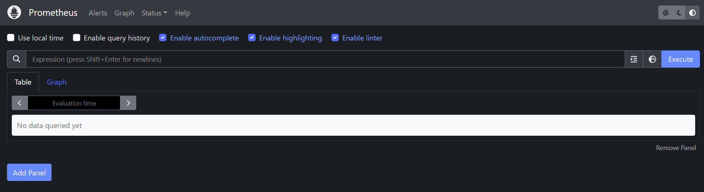
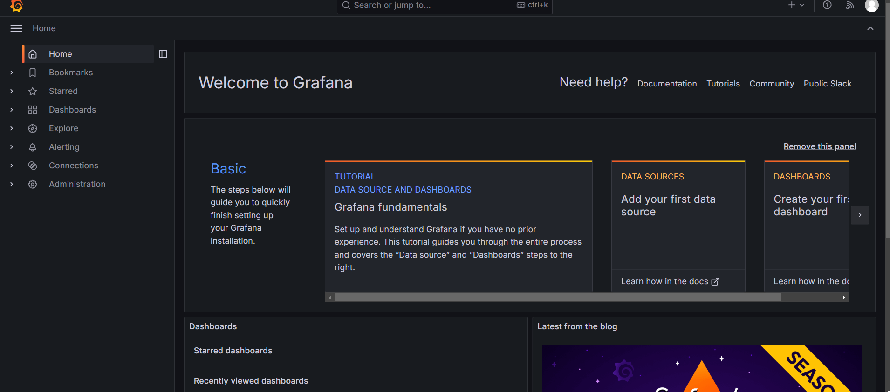

Minikube, Prometheus, and Grafana Startup Guide for Future Students
This guide will walk you through the steps of setting up Minikube, Prometheus, and Grafana in a Kubernetes environment. These tools are great for learning about Kubernetes, monitoring, and data visualization, and they’re often used in software engineering, data science, and DevOps courses.

Prerequisites
Before you begin, make sure you have:

A computer with at least 4 GB of RAM and 2 CPUs for Minikube to run smoothly.
Homebrew installed (for macOS users) or any other package manager you prefer.
Basic familiarity with command-line tools (don't worry, we’ll explain the commands).
Step 1: Install Minikube
Minikube runs a local Kubernetes cluster on your machine, which makes it perfect for learning. To install Minikube:

On macOS:
Open your terminal and install Minikube via Homebrew:

brew install minikube
On Windows or Linux:
Follow the installation instructions here: https://minikube.sigs.k8s.io/docs/
Once installed, start Minikube by running:

minikube start
This command starts your local Kubernetes cluster. You can check if it’s running correctly:
kubectl cluster-info

If everything is set up correctly, you should see details about your Kubernetes cluster.

Step 2: Install Helm (Package Manager for Kubernetes)
Helm is a package manager for Kubernetes, similar to how you use apt on Ubuntu or brew on macOS. It makes installing and managing complex applications like Prometheus and Grafana much easier.

On macOS:
brew install helm

On Linux:
curl https://get.helm.sh/helm-v3.10.0-linux-amd64.tar.gz -o helm.tar.gz
tar -zxvf helm.tar.gz
mv linux-amd64/helm /usr/local/bin/helm

Check if Helm was installed successfully:
helm version

Step 3: Add Helm Repositories for Prometheus and Grafana
Now, we’ll add the Helm repositories that contain the Prometheus and Grafana charts (pre-packaged Kubernetes applications).

helm repo add prometheus-community https://prometheus-community.github.io/helm-charts
helm repo add grafana https://grafana.github.io/helm-charts
helm repo update
Step 4: Install Prometheus
Prometheus will help you monitor your applications by collecting and storing metrics. We’ll install it using Helm.

Run the following command to install the Prometheus stack:
helm install prometheus prometheus-community/kube-prometheus-stack

This installs both Prometheus and Alertmanager, which will help in managing alerts when something goes wrong.

Step 5: Install Grafana
Grafana is a visualization tool for displaying the data Prometheus collects. Let’s install Grafana separately with Helm:

helm install grafana grafana/grafana

You can verify if everything is installed by running:
helm list
This will show the Helm releases, including Prometheus and Grafana.

Step 6: Access Prometheus and Grafana Dashboards
Minikube exposes Kubernetes services locally, so you’ll need to run minikube tunnel to access the services via a local URL.

Run the following command to start the tunnel:

minikube tunnel
Access Prometheus:
Find the Prometheus URL by running:

kubectl get svc prometheus-kube-prometheus-prometheus -n default
Then, open your browser and go to http://<minikube-ip>:<prometheus-port>. You’ll be able to view Prometheus' dashboard here.

Access Grafana:
Similarly, you can find the Grafana URL by running:

kubectl get svc grafana -n default
Navigate to http://<minikube-ip>:<grafana-port> to access the Grafana dashboard.

Step 7: Log in to Grafana
By default, Grafana uses the following credentials:

Username: admin
Password: prom-operator
After logging in, you’ll need to configure Prometheus as a data source to start visualizing your metrics. Grafana usually auto-discovers Prometheus if it’s running in the same Kubernetes cluster.

Step 8: Verify Everything is Running
Check the status of your Prometheus and Grafana pods with:

kubectl get pods
This will list all the pods running in your Kubernetes cluster. You should see Prometheus, Grafana, and related services running.

Optional: Use Minikube Dashboard
If you prefer a graphical user interface (GUI) to manage your Minikube cluster, you can launch the Minikube dashboard:

minikube dashboard
This will open a web interface that allows you to view your Kubernetes resources, such as services, pods, and deployments.

port forwarding with grafana:
kubectl port-forward svc/grafana 3000:80 -n default
user: 
password: get from this command: kubectl get secret grafana -n default -o jsonpath="{.data.admin-password}" | base64 --decode

Final Thoughts
Congratulations! You’ve now set up a local Kubernetes environment with Prometheus and Grafana on Minikube. This setup is great for learning how to monitor and visualize data within Kubernetes, and it will be a valuable skill in courses related to DevOps, cloud computing, and data engineering.