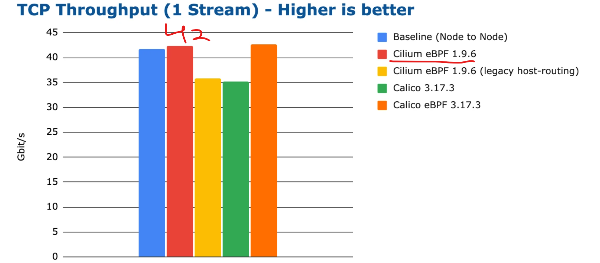
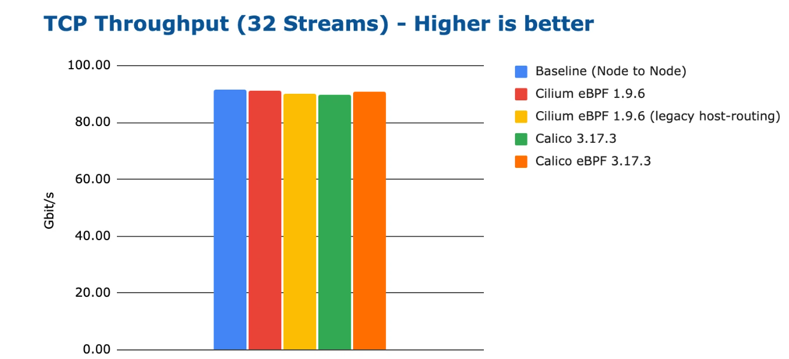

Learning progress of TCP/IP

TCP Throughput benchmark
- Maximum data transfer rate between containers that are running on different nodes. running netperf like we did previously is how it is measured.

1 stream (1 TCP connection) Performance:

How do we increase performance using mutiple TCP streams?

Shows that by upgrading and maximizing CPU usage, performance will go up. HOWEVER, the usage of the CPU allocated will vary by percentage between Clium and calico. CIlium is good for this and users a smaller percentage of the CPU:

Some Future tests/ updates that the future teams could do to imporve cilium:

    * eBPF map sizes
        - Currently, the eBPF maps are pre-sized, so it would always use a minimal amount of memory
        - Proposed solution: come up with a way to not have a pre-size allocation and have it dynamically size the eBPF map and memory needed 

    * Enable hubble
        - run testing for observability of the CPU, memory, and latency across different work loads. Stress testing and limit testing.
        - Dynamic Workload Observability: Simulate real-world scenarios by dynamically scaling workloads and measure how Hubble adapts to increased demand for observability.

    *Scalability
        - Use more node clusters 
        - Test node failures