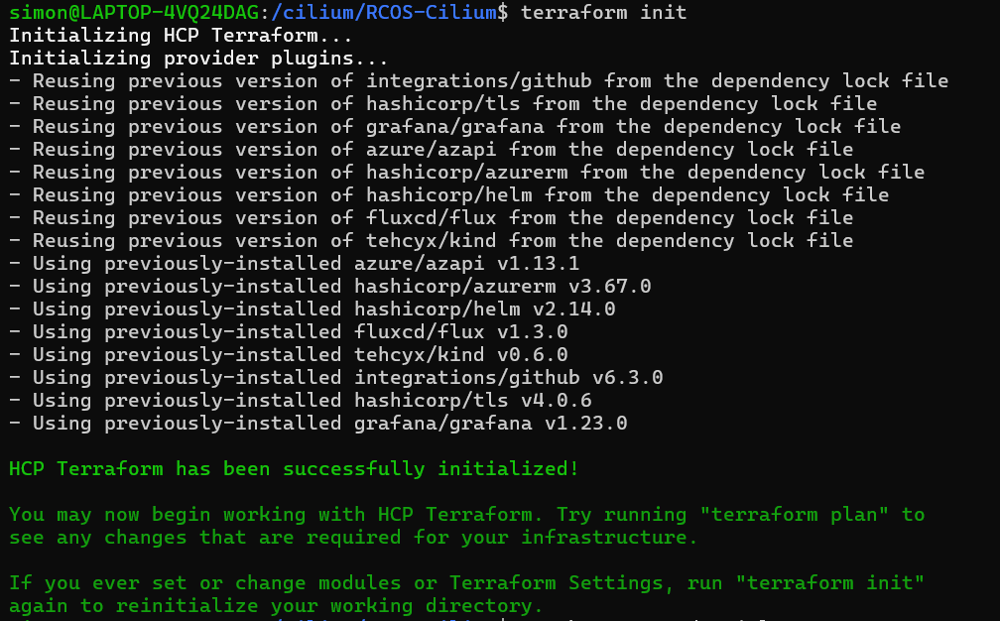
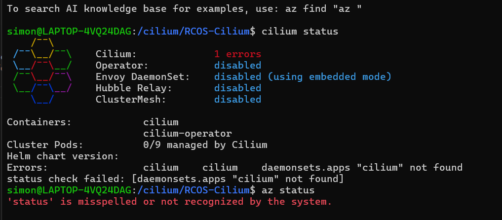

On Tuesday, I was still stuck on the az migration. This Friday, I was finally able to get the az aks command working. The problem was that for the command  az aks get-credentials --resource-group RCOS-Cilium_group --name test-cilium-aks, "RCOS-Cilium_group" doesn't exist in my azure portal. To solve this problem, I had to swap RCOS-Cilium_group for az aks get-credentials --resource-group test-Cilium.rg --name test-cilium-aks to finally be able to access my resources. This is becuase the group that I am in for azure is the test-Cilium.rg group and that is the only one that I have been added as a contributer to. The startup.md file didn't have the name test-Cilium.rg and instead had RCOS-Cilium group in it and that was why alot of the group members were confused. 

Next week, I plan to work on the performance testing now that everything is configured properly. I want redo some of the previous performance tests and make sure that they are up to date and still running well. Additionally, I want to experiment more with azure and figure out all the commands.

First steps:

Final Steps to make sure that the azure aks successfully worked and that you are able to access the resources:

After running the az aks credentials, want to make sure that you are using the resources for that azure branch:
run command "cilium status"

Commands to run
terraform init
az aks get-credentials --resource-group test-Cilium.rg --name test-cilium-aks

check cilium:
run: cilium status
example result:
